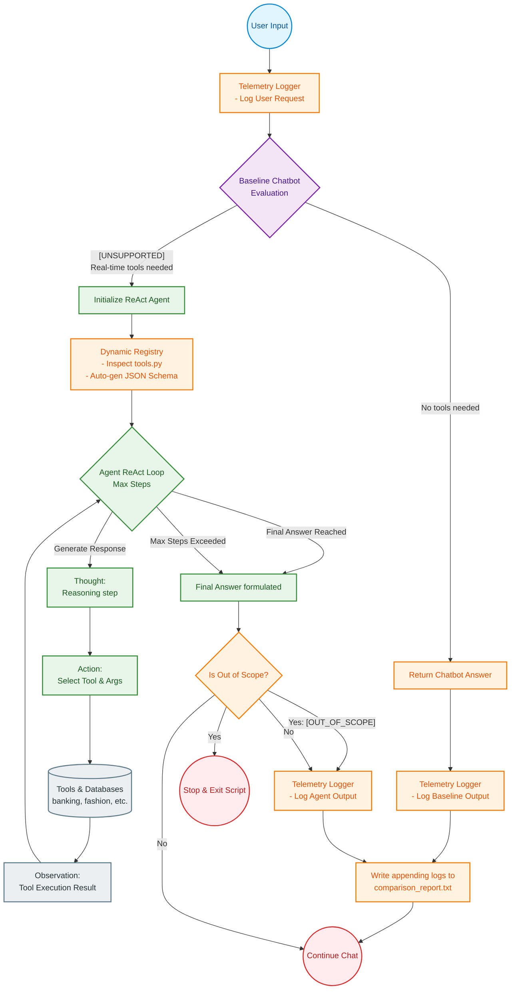

# System Architecture & Flowchart

Below is the Mermaid flowchart visualizing the control flow of the Chatbot vs. ReAct Agent system.

```mermaid
flowchart TD
    %% Define styles
    classDef user fill:#e1f5fe,stroke:#0288d1,stroke-width:2px,color:#01579b;
    classDef system fill:#fff3e0,stroke:#f57c00,stroke-width:2px,color:#e65100;
    classDef llm fill:#f3e5f5,stroke:#7b1fa2,stroke-width:2px,color:#4a148c;
    classDef agent fill:#e8f5e9,stroke:#388e3c,stroke-width:2px,color:#1b5e20;
    classDef database fill:#eceff1,stroke:#607d8b,stroke-width:2px,color:#263238;
    classDef endnode fill:#ffebee,stroke:#d32f2f,stroke-width:2px,color:#b71c1c;

    %% Nodes
    Start((User Input)):::user
    LogInput[Telemetry Logger</br>- Log User Request]:::system
    
    CheckBaseline{Baseline Chatbot</br>Evaluation}:::llm
    HasAnswer[Return Chatbot Answer]:::system
    LogBaseline[Telemetry Logger</br>- Log Baseline Output]:::system
    
    InitAgent[Initialize ReAct Agent]:::agent
    DynamicTools[Dynamic Registry</br>- Inspect tools.py</br>- Auto-gen JSON Schema]:::system
    
    AgentLoop{Agent ReAct Loop</br>Max Steps}:::agent
    AgentThought[Thought:</br>Reasoning step]:::agent
    AgentAction[Action:</br>Select Tool & Args]:::agent
    
    ToolDB[(Tools & Databases</br>banking, fashion, etc.)]:::database
    AgentObs[Observation:</br>Tool Execution Result]:::database
    
    AgentFinalAnswer[Final Answer formulated]:::agent
    CheckScope{Is Out of Scope?}:::system
    
    LogAgentEnd[Telemetry Logger</br>- Log Agent Output]:::system
    StopSystem((Stop & Exit Script)):::endnode
    ContinueLoop((Continue Chat)):::endnode
    
    SaveReport[Write appending logs to</br>comparison_report.txt]:::system

    %% Edges
    Start --> LogInput
    LogInput --> CheckBaseline
    
    CheckBaseline -- "No tools needed" --> HasAnswer
    CheckBaseline -- "[UNSUPPORTED]</br>Real-time tools needed" --> InitAgent
    
    HasAnswer --> LogBaseline
    LogBaseline --> SaveReport
    SaveReport --> ContinueLoop
    
    InitAgent --> DynamicTools
    DynamicTools --> AgentLoop
    
    AgentLoop -- "Generate Response" --> AgentThought
    AgentThought --> AgentAction
    AgentAction --> ToolDB
    ToolDB --> AgentObs
    AgentObs --> AgentLoop
    
    AgentLoop -- "Final Answer Reached" --> AgentFinalAnswer
    AgentLoop -- "Max Steps Exceeded" --> AgentFinalAnswer
    AgentFinalAnswer --> CheckScope
    
    CheckScope -- "Yes: [OUT_OF_SCOPE]" --> LogAgentEnd
    CheckScope -- "No" --> LogAgentEnd
    
    LogAgentEnd --> SaveReport
    
    CheckScope -- "Yes" --> StopSystem
    CheckScope -- "No" --> ContinueLoop
```
